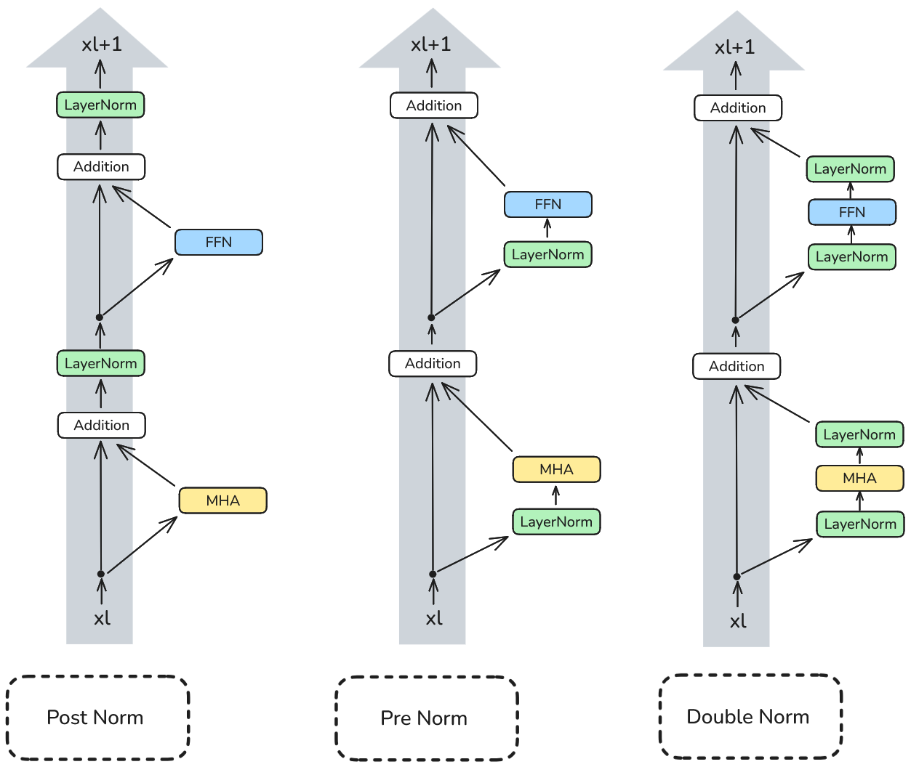
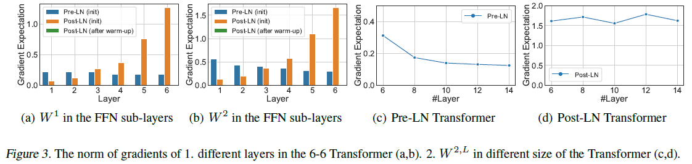
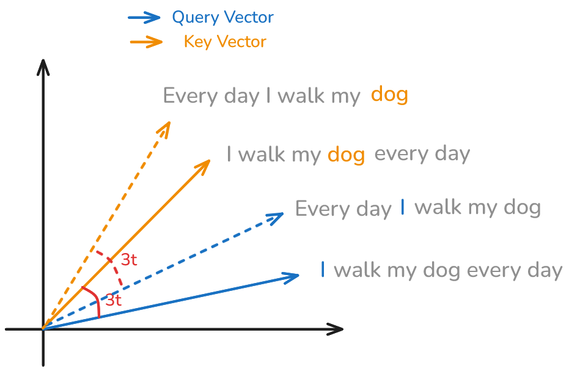
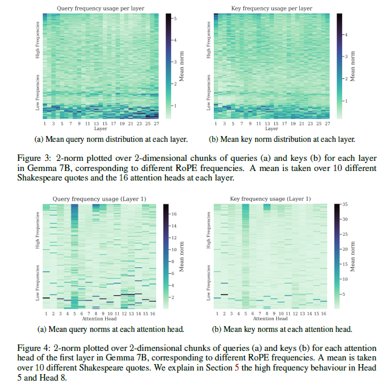

# Purpose

This file notes down the important insights/highlights of the papers that are being implemented in modern LLMs.

# Papers
## [Root Mean Square Layer Normalization](https://arxiv.org/abs/1910.07467) (Zhang 2019)

### LayerNorm
$$
y_i = \frac{x_i - \mu}{\sigma} \cdot g_i + b_i
$$

$$
\mu = \frac{1}{n} \sum^n_{i=1}x_i \hspace{15pt} 
\sigma = \sqrt{\frac{1}{n} \sum^n_{i=1}(x_i - \mu)^2}
$$

- LayerNorm has invariance on re-centering and re-scaling.

### RMSNorm
$$
y_i = \frac{x_i}{\sqrt{\frac{1}{n} \sum^n_{i=1}x_i^2}} \cdot g_i
$$

- RMSNorm simplifies LayerNorm by removing the mean $\mu$ and bias $b$. This resulted in less computation without sacrificing performance.
- Paper argued that only the re-scaling invariance matters.
- The activations are scaled by Root Mean Square (RMS), which ensures unit scale that benefits stability. 
    - Imagine mapping the activations into $\sqrt{n}$-scaled unit sphere.
    - Robust across vectors of different size, e.g. L2 norm does not work.

## [On Layer Normalization in the Transformer Architecture](https://arxiv.org/abs/2002.04745) (Xiong 2020)

- PostNorm requires a learning rate warm-up stage.
    - Requires longer training time and hyperparameter tuning.
    - During initialization, the gradient norm is large near the output layer, hence need small learning rate at start. (Refer to the graph below)

- On the other hand, PreNorm and DoubleNorm are the main trend nowadays by having well-behaved gradient.
    - One explanation is that they have a clean residual highway for backpropagation without any norm layers in between.

## [RoPE](https://arxiv.org/abs/2104.09864) (Su 2021)

- Attention is position agnostic. Hence, need to inject postional information to query and key tokens.
- RoPE suggested using a rotation (refer to matrix below) to inject the positional information:
    - Let the original query and key vectors be $q$ and $k$ respectively.
    - The rotated vectors are $q' = R_{\theta} q$ and $k' = R_{\theta} k$.
$$
R_\theta =
\begin{bmatrix}
\cos{\theta} & -\sin{\theta} \\
\sin{\theta} & \cos{\theta} \\
\end{bmatrix}
$$

- Rotation does not increase the norm of the vector thereby preventing exploding gradients.
- RoPE provides both absolute and relative positional information.
    - For example, consider the example below, the dot product of "I" and "dog" from both sentences will be the same.
    - $q' \cdot k' = q'^Tk' = (R_{m\theta}q)^T(R_{n\theta}k) = q^T(R_{-m\theta}R_{n\theta})k = q^TR_{(n-m)\theta}k$

- In particular, each rotation matrix is apply to pairs of embedding elements $\in \mathbb{R}^d$.
    - The angle increases linearly with the position. The angle at position 1 will be $\theta$, position 2 will be $2\theta$, position k will be $k\theta$.
    - The angle also decreases exponentially with the dimension.
$$
\theta_{i,k}=\frac{i}{\Theta^{(2k-1)/d}}, k \in \{1, \ldots, d/2\}
$$

- An efficient implementation of RoPE for a single embedding at position $i$ is as follows:

$$
R^ix=
\begin{bmatrix}
x_1 \\
x_2 \\
\vdots \\
x_{d-1} \\
x_d \\
\end{bmatrix}

\otimes
\begin{bmatrix}
\cos{\theta_{i,1}} \\
\cos{\theta_{i,1}} \\
\vdots \\
\cos{\theta_{i,d/2}} \\
\cos{\theta_{i,d/2}}
\end{bmatrix}

+

\begin{bmatrix}
-x_2 \\
x_1 \\
\vdots \\
-x_d \\
x_{d-1} \\
\end{bmatrix}

\otimes
\begin{bmatrix}
\sin{\theta_{i,1}} \\
\sin{\theta_{i,1}} \\
\vdots \\
\sin{\theta_{i,d/2}} \\
\sin{\theta_{i,d/2}}
\end{bmatrix}
$$

## [Round and round](https://arxiv.org/abs/2410.06205) (Barbero 2024)

- Angles are typically set as $\theta_{k}=\Theta^{-(2k-1)/d}, k \in \{1, \ldots, d/2\}$
    - $\theta_1$ is the fastest rotating component with 1 radian per token.
    - $\theta_{d/2}$ is the slowest rotating component around $1/\Theta$ per token.
    - Default $\Theta$ is set to $10,000$, recently increased to $500,000$.
- For high frequencies, a small perturbation in token sequence give largely different activation contribution, i.e. dot product is greatly affected.
- Using $q \cdot v \leq ||q||||v||$, look a the norm of $q, v$ as an upper bound for dot product.

### High Frequencies: Positional Attention
- In Figure 4, head 5 and head 8 correspond to positional attention heads used high frequencies.
    - Head 5 keeps track of the token position and head 8 keeps track of the previous token position.
- High frequencies in RoPE provide a mechanism to construct postional attention patterns.

### Low Frequencies: Semantic Attention
- In Figure 3, lowest ferquencies have much higher norm on average. And some high frequency usage in the first and last layer.
- Low frequencies in RoPE tend to be used by semantic attention heads, as the rotation based on relative distance between tokens has minimal impact on the dot product.
- Low frequencies are most invariant to relative distance but **eventually misaligned** over long relative distance, which explains why increasing $\Theta$ to $500,000$ seems helpful.
- RoPE lacks robust semantic channels since low frequencies can still rotate to arbitrary value over a long enough context.
    - Author proposed to remove the low frequencies positional encoding to provide robust semantic channels.

